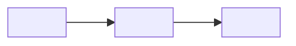

# House-style README template

This is the reference skeleton for a judge-ready hackathon README. It is a
*menu*, not a fixed form — keep the core sections, pull in optional ones when
they fit the project and the event, and reorder so the highest-weighted judging
criteria sit highest. Replace every `<...>` and delete any section that would be
padding. Never invent demo links, metrics, file paths, or teammates; use a
clearly-marked `<!-- TODO -->` placeholder instead.

The annotations in `( )` explain *why* a piece is there — don't copy them into
the output.

---

```markdown
# <Project Name>

<!-- Optional: centered logo or mascot. Big trust/polish signal if one exists. -->
<p align="center">
  " alt="<project> logo" width="120" />
</p>

<!-- Centered tech badge row. Pick the real stack; see badges.md for snippets.
     Badges make the stack legible in one glance and read as "polished". -->
<p align="center">
  -<hex>?style=for-the-badge&logo=<logo>&logoColor=white" />
  <!-- ...one per major technology... -->
</p>

---

<!-- Event + submission context, so a judge knows what they're looking at. -->
**<Event name> Submission**  
**Event dates:** <dates>

<!-- Tagline: the pitch in one sharp sentence. Italic inside a blockquote. -->
> *<One-line tagline — what it is and why it matters, memorable.>*

<!-- Demo and video as badge-buttons near the very top: judges click these first.
     Add dataset / Colab / "reproduce" buttons too if the project has them. -->
**Live demo:**

<p align="center">
  <a href="<demo-url>">
    
  </a>
</p>

<!-- 🎥 Demo video: <video-url>   (or a TODO placeholder if not recorded yet) -->

<!-- A screenshot or GIF, if available — single biggest perceived-polish lift. -->


## Team

| Member | Role |
|--------|------|
| <Name> | <role / links> |

<!-- Optional: Acknowledgments for people who helped but aren't on the team. -->

## The problem
<!-- Or "Why this matters". 2–4 sentences, concrete and human: who hurts and why
     it matters now. This carries the impact criterion. -->

## What it does
<!-- Plain-language description of the solution. Bullet the 3–4 headline
     features, leading with the most impressive/innovative one. -->

## How it works
<!-- A few sentences of architecture, then numbered steps that cite REAL files
     from the repo scan (e.g. `src/lib/check.js`, `app/main.py`). Call out the
     technically hard part here — this is where technical-execution points are
     earned. Add a Mermaid diagram for multi-stage pipelines. -->

1. **<Stage>** — <what happens>, in `<real/file/path>`.
2. **<Stage>** — ...

## Tech stack

| Layer | Technology |
|-------|------------|
| Frontend | <...> |
| Backend  | <...> |
| AI / ML  | <...> |
| Deploy   | <...> |

## Run locally
<!-- Verified against the repo. Real prerequisites, env vars, and commands.
     Show expected output where you can — it proves the thing runs. -->

```bash
<install command>
<run command>          # <real dev URL, e.g. http://localhost:5173>
```

<!-- If env vars are needed: -->
```bash
cp .env.example .env   # then fill in:
# <KEY>=
```

## Project structure
<!-- A trimmed tree of the meaningful files, annotated. Grounds the reader and
     shows the project is real and organized. -->

```text
<project>/
├── <entry>            # <what it does>
├── src/ ...           # <...>
└── ...
```

## Roadmap / What's next
<!-- Where it goes with more time. Milestones or a scaling table both work.
     Signals vision beyond the demo. -->

## Judging Highlights
<!-- The rubric-anchoring, made visible. ONE bullet per judging criterion from
     Step 1, each pointing at how the project meets it. This does the judge's
     job for them and is a strong differentiator. -->

- **<Criterion 1, e.g. Innovation>:** <how the project delivers it.>
- **<Criterion 2, e.g. Technical execution>:** <...>
- **<Criterion 3, e.g. Impact>:** <...>
- **<Criterion 4, e.g. Polish>:** <...>

## License
<!-- e.g. Code under MIT, data under CC BY 4.0. Only state what's real. -->
```

---

## Optional sections (add when they fit)

Pull these in based on the event flavor (Step 1) and what's genuinely true of the
project. They're what separates a strong academic/techsprint submission from a
bare one — but on a lean product hack they're noise, so don't force them.

**Headline results / metrics** (data, ML, or benchmark projects)
```markdown
## Headline results

| Metric | Value | What it means |
|--------|------:|---------------|
| <name> | <val> | <plain-language meaning> |

<!-- A note on sample size / caveats reads as honest and rigorous. -->
```

**Mermaid pipeline diagram** (multi-stage systems)
```markdown

```

**Demo flow** — a numbered "click here, then here" walkthrough so a judge can
reproduce the wow moment, plus (for offline/edge projects) a "what works
offline" list.

**AI-use disclosure** (academic events) — which AI tools were used for what, and
a line that the team remains responsible for all claims. Mark AI-generated data
as unverified until human-reviewed.

**Data protection / privacy / ethics** (anything involving people or collected
data) — consent, anonymization, right to withdraw, intended-use limits.

**UN SDG alignment** (impact-oriented academic events) — the specific SDGs the
project supports, with a sentence each.

**References & citations** — datasets, papers, docs, and APIs you built on.

**Current status** — a built/deployed checklist plus a short "final polish before
judging" list (add screenshots, test on the demo device). Honest and useful.
```
